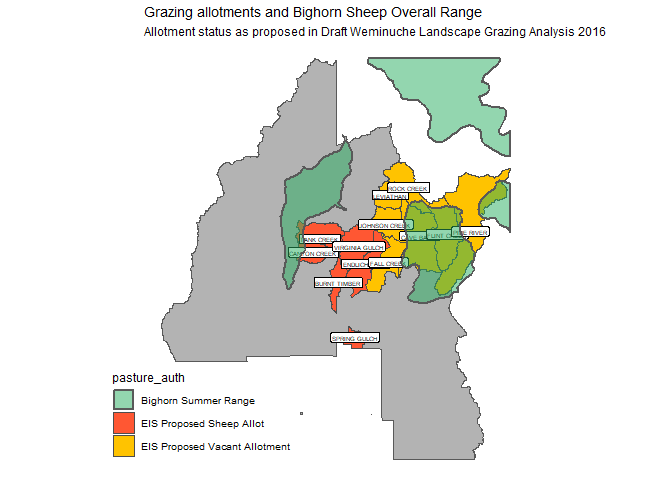
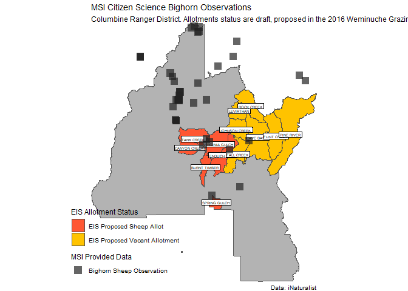

## General

- Population Estimate (in DAU Plan 2012): 460 (200 in S-15, 135 in S-16,
  and 125 in S28) (CPW 2012)
- Population Estimate 2022: 395, a decrease of 17% from 2012 (180 in
  S15, 135 in S16, 80 in S28). The largest decrease was in S-28
  (Vallecito), a decrease of 36%.
- Population Estimate in 2023: Decreased!!
  - S28 - 50 (was 80)
  - S16 - 100 (was 135)
  - S15 - 140 (was 180)
  - Total - 290 (was 395 \[26% reduction\])
- Statewide 6,900.

## Conservation Status Notes

- [CPW Statewide Action
  Plan](https://cpw.state.co.us/Documents/WildlifeSpecies/SWAP/CO_SWAP_FULLVERSION.pdf):
  Tier 2
- Forest Service:
  [Sensitive](https://www.fs.usda.gov/Internet/FSE_DOCUMENTS/stelprdb5318798.pdf)
- BLM Colorado: Sensitive
- CPW Satus: **Tier 1 Herd** (A Primary Population). Tier 1 herds: “are
  regarded as those large (i.e., ≥100 animals for ≥90% of the years
  since 1986), native populations comprised of one or more
  interconnected herds (in, or to be designated into, GMUs) that have
  received few (i.e., ≤50 animals total) if any supplemental releases of
  Rocky Mountain bighorn sheep in the past. Tier 1 populations should be
  given the highest priority for inventory, habitat protection and
  improvement, disease prevention, and research.” (CPW 2021)
- [Nature Serve:
  Worldwide](https://explorer.natureserve.org/Taxon/ELEMENT_GLOBAL.2.102557/Ovis_canadensis)
  = G4 (Apparently Secure), Colorado = S4 (Apprently Secure)

## History

Excerpts from CPW DAU Plan:

- 1911 - “Forest Ranger E. E. Chapson, of Pagosa Springs, says that a
  good many sheep are killed by snowslides in the San Juan Mountains
  north of that point.”
- “In 1962 Moser documented locations occupied by bighorn sheep
  representing a large geographical area within the San Juan Mountains.
  This included Cimarron Peak, South River Peak, Weminuche Creek,
  Grenadier Range, Sunshine Peak, and Engineer Mountain”
- “By 1973 the range of bighorn sheep had decreased significantly from
  historic occurrence. Summer range consisted of three main areas. The
  first was the country north of Wolf Creek Pass to Table Mountain and
  west to Beaver Creek. The second area included the headwaters of
  Weminuche, Cimarrona, Hossick, and Williams Creeks. And the third was
  the region between the Los Pinos River and Vallecito Creek north to
  Rock Creek (Bear and Jones 1973). The western areas, past Vallecito
  Creek, were no longer presented as occupied habitat.”

## Collaring and Disease Study

### Collaring Effort

## Todo

\[ \] - Need to look in more detail the observations that overlap with
non-vacant allotments. \[ \] - add active allotments in Silverton.
