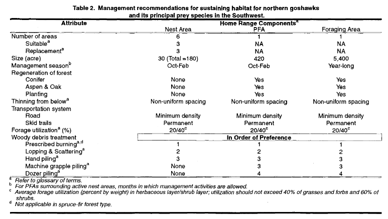

This document is notes on Northern Goshawks (*Accipiter gentilis*)
generally with specific information pertaining to Goshawks on the
Columbine District of the San Juan National Forest.

## Why are Goshawks Important to the San Juan?

- **Goshawks are declining accross North America.**
  ([1](https://www.rpi-project.org/species-conservation-northern-goshawk-accipiter-gentilis/))
  Migratory monitoring locations accross the Unites States show a 46%
  decline in detections from 2009 to 2019. eBird trend estimates show
  declines accross their range. eBird data has does not have enough data
  to determine trend in most of Region 2.
- **Goshawks require relatively dense forest stands for nesting.**
  Activities that reduce nest stand density decrease potential nest
  stand quality. It has been shown that nest stands that have been
  reduced in tree density show a significan decrease in nest site
  fidelity.
- **Goshawks show high Nest Site Fidelity.** Goshawks return to the same
  territory year after year, often for life, and nest stands can be used
  by multiple generations.
- **We don’t know that much about Goshawks on the San Juan.** Given the
  above, we don’t know that much about Goshawks. We don’t know how many
  nests we have, we don’t know how many nests are active and we don’t
  know how our activities are affecting goshawks. Dolores RD has done
  the most to determine their status. But staff time drastically limits
  how much we know about the species and its status.

But this leads me to my next issue. I’m not sure we will ever know as
much as we want to because surveys are time intensive, hard to time
phenologically and because goshawks don’t nest every year.

## Goshawk Nest Survey Methodology Summary

There are four methods to find goshawk nest sites:

1.  **Dawn accustical surveys** - During early breeding (March 15th to
    April 28th - courtship, prior to female laying eggs) establish
    listening stations. Helpful if you know if it is good habitat or you
    are near a nest.

> “*single-visit detection rates obtained with this method are about 97
> percent at goshawk sites with active nests, 73 percent at sites with
> occupied nonbreeding status, and 43 percent at unoccupied historical
> nest stands (table 3.1). If survey objectives require detection of
> sites with nonbreeding adults, then two visits are required to achieve
> detection rates greater than 90 percent.*”

2.  **Intensive Search Survey** - Closely spaced, 20m to 30m apart,
    surveys where surveyors look for Goshawk sign. Sign can be nests,
    feathers, whitewash or prey remnants. Broadcast call can be done
    coincidentally.
3.  **Broadcast Accoustical** - Broadcast call transects that are less
    than 250m apart, with call points 200m apart along a transect.
    Transects should be staggered 100m from one tranect to the another,
    so that call points better cover an area. Surveys should occur from
    June 1 to August 15. At each calling station, broadcast at 60
    degrees from the transect line for 10 seconds, then listen and watch
    for 30 seconds. Repeat this sequence two more times, rotating 120
    degrees from the last broadcast. During the nestling stage,
    broadcast the adult alarm call. During the late nestling and
    fledgling stages, broadcast the juvenile begging or wail call. This
    call is more likely to elicit responses from juvenile goshawks.
4.  **Aerial Survey** - Survey froma plane or drone.

Intensive search and broadcast accoustical survey will typically be used
the most.

*/ **Table 3.2** from Woodbridge and Hargis, 2006*

<table style="width:100%;">
<colgroup>
<col style="width: 16%" />
<col style="width: 16%" />
<col style="width: 16%" />
<col style="width: 16%" />
<col style="width: 16%" />
<col style="width: 16%" />
</colgroup>
<thead>
<tr>
<th><strong>Survey Type</strong></th>
<th><strong>Timing</strong></th>
<th><strong>Nest Status</strong></th>
<th><strong>1st Visit Succes</strong></th>
<th><strong>2nd Visit Success</strong></th>
<th><strong>3rd Visit Success</strong></th>
</tr>
</thead>
<tbody>
<tr>
<td>Dawn accustical surveys</td>
<td>Local Dependent</td>
<td>Nesting</td>
<td>97%</td>
<td>NA</td>
<td>NA</td>
</tr>
<tr>
<td></td>
<td></td>
<td>Occupied nonnnesting</td>
<td>73%</td>
<td>~90%</td>
<td>NA</td>
</tr>
<tr>
<td></td>
<td></td>
<td>Unoccupied Historical</td>
<td>43%</td>
<td>NA</td>
<td>NA</td>
</tr>
<tr>
<td>Intensive Search Survey</td>
<td>late June through August</td>
<td>Nesting</td>
<td>97%</td>
<td>100%</td>
<td>100%</td>
</tr>
<tr>
<td></td>
<td></td>
<td>Occupied nonnesting</td>
<td>74%</td>
<td>93%</td>
<td>98%</td>
</tr>
<tr>
<td></td>
<td></td>
<td>Unoccupied Historical</td>
<td>43%</td>
<td>67%</td>
<td>81%</td>
</tr>
<tr>
<td>Broadcast Accoustical</td>
<td>June 1 to August 15</td>
<td>Nesting</td>
<td>90%</td>
<td>94%</td>
<td>100%</td>
</tr>
<tr>
<td></td>
<td></td>
<td>Occupied nonnesting</td>
<td>64%</td>
<td>87%</td>
<td>96%</td>
</tr>
<tr>
<td></td>
<td></td>
<td>Unnoccupied Historical</td>
<td>36%</td>
<td>59%</td>
<td>73%</td>
</tr>
</tbody>
</table>

## Goshawk Nest Survey Timing in Relation to Projects.

Two survey methods will be used the most, Broadcast Accoustical and
Intensive Search. These surveys should be conducted either the year
before a project is conducted or the year the project is conducted prior
to project implementation. In some cases surveys prior to one year
before the project is implemented may be allowed if an effeciency is
gained.

## What will we do after we find a Goshawk Nest

### Definition of Important habitat areas (Renolds et. al 1992)

**Nest Areas (30 acres each)** - *“Three suitable nest areas should be
maintained per home range. In addition, three replacement nest areas per
home range should be in a development phase, using intermediate
treatment and prescribed fire. Suitable areas may be lost because of
insect epidemics, catastrophic fire, or other factors. Nest areas are
typified by one or more stands of mature or old trees and dense forest
canopies. No adverse management activities should occur at any time in
suitable nest areas. Desired forest conditions for the nest stands and
management recommendations for maintaining and developing nest stands.”*

**Post Fledging-Family Areas (PFA) (420 acres)** - *“The PFA contains a
variety of forest conditions and prey habitat attributes. Interspersed
small openings, snags, downed logs, and woody debris are critical PFA
attributes. To sustain the desired canopy cover, size of trees, and the
specified portions of different forest ages within the PFA, regeneration
of 10 percent of the PFA may be required every 20 years. Other
management tools, such as prescribed fire and removing understory trees,
are suggested for sustaining other critical elements of goshawk habitat
(Table 2). Small openings in the forest are desired habitat for some
prey species and are required for forest regeneration (Fig. 6). If
forested openings are 1.0 acre or greater in Ponderosa pine and mixed
species, then 3 to 6 large mature and/or reserve old trees per acre
should be left in groups. If spruce-fir forest openings are 0.5 acres or
greater, a group of 6 reserve trees are required per 0.5 acres. Reserve
trees are not necessary in smaller openings; this component can be met
in adjacent forested areas.. Ponderosa pine and other seral conifers can
be planted, and, depending on forest type, aspen and oak regeneration
are encouraged. Snags, downed logs, and woody debris should be present
throughout the PFA. All management activities in the PFA should be
limited to the period from October through February. Prescribed burning
is the preferred method for management of woody debris. Thinning from
below (removing understory trees) is preferred for maintaining desired
forest structures, and a variable spacing of trees is preferred for
developing groups of trees with interlocking crowns. Road densities
should be minimized, and permanent skid trails should be used in lieu of
permanent roads. Forage utilization should average 20 percent by weight
and should not exceed 40 percent in any area to maintain grass and forb
layer. Browse utilization should average 40 percent by weight (Table 2).
These recommendations are designed to provide foods (leafy material,
berries) and cover for goshawk prey.”*

**Foraging Area (5,400 acres)** - *“Both the desired conditions and the
management recommendations for the foraging area are similar to the PFA.
The distribution and proportion of vegetative structural stages and the
requirements for habitat attributes such as reserve trees, snags, and
downed logs are the same as the PFA. Because the foraging area need not
provide hiding cover for fledgling goshawks, a more open canopy is
preferred – 40 percent in the mid-aged forests and 40 to 60 percent in
the mature and old forests, depending on the forest type. Openings (up
to 4 acres), for herbaceous and shrubby understory development and tree
regeneration, are desired in ponderosa pine and mixed-species forests;
smaller openings are desired in spruce-fir forests (Table 1). Specific
management recommendations to obtain the desired conditions for the
foraging area are identical to the PFA (Table 2).”*”

<figure>

<figcaption aria-hidden="true">“Table of Nest, Post Fledgling-Family
Area and Foraging Area Data”</figcaption>
</figure>

## Document Excerpts:

### Forest Service Region 2 Sensitive

The Northern Goshawk is the listed as sensitive in Forest Service Region
2. [Rationale for
Listing](https://www.fs.usda.gov/Internet/FSE_DOCUMENTS/stelprdb5253676.pdf):

> Crocker-Bedford (1998) found that nest fidelity decreased
> significantly in harvested forests from that found in unharvested
> forests.

> Some 90 percent of the species habitat in the Southern Rockies is
> found on National Forest System lands. Consequently, the landscape
> level management strategies of the Forest System has substantial
> potential for determining the future of this species within the
> ecosystems of R2.

From the [Sensitive Species listing
Evalution](https://www.fs.usda.gov/Internet/FSE_DOCUMENTS/stelprdb5369460.pdf):

> Forests in the region vary dramatically in their goshawk survey
> techniques and locations that are surveyed. Some Forests like the
> Medicine Bow/Routt and Black Hills have a large timber program and
> conduct numerous goshawk surveys. Other Forests such as the White
> River and San Juan have a relatively small timber program and have
> conducted very limited goshawk surveys. This leads to very large
> discrepancies in the data between forests and habitat types. For
> example on the Brush Creek/Hayden District of the Med/Bow over 100
> nests have been documented mostly from transects used to clear timber
> sales. On the entire White River NF with more habitat acreage, only
> approximately 15-20 nests are known and the majority of those have
> been found in areas not officially surveyed, but were observations
> from the public or agency personnel

> The R2 Goshawk team (2) found that actual population trend data for
> goshawks is very limited within the region. The USFWS, (3) itself
> stated that the majority (75%) of reported territories analyzed for
> the status review were discovered in the last 10 years. The R2 goshawk
> team was not able to find any experts within the region that could
> supply population trend data. The team further suggested that nest
> monitoring and other protocols be undertaken region wide in order to
> begin the baseline information data gathering that could be used later
> for population trend projections.

> Kennedy (7) after a comprehensive review of peer-reviewed research
> concluded that there is no strong evidence to indicate that goshawk
> populations are declining, increasing or stable. She also stated
> that 1) either the goshawk is not declining or 2) current sampling
> techniques are insufficient to detect population trends.

> In the Southern Rockies Region 93.8% of all the land acreage is within
> 0-2 miles of a road

> Squires (6) indicated nesting habitat is the most important component
> in limiting B distribution and numbers of birds. In the Black Hills
> Forest Plan Revision, the experts( Squires, Reynolds) considered a
> lack of providing landscape level nesting habitat as a major negative
> effect.

## Resources

### Status and Policy

- [Goshawk - Raptor Population
  Index](https://www.rpi-project.org/species-conservation-northern-goshawk-accipiter-gentilis/)
- [R2 Northern Goshawk Sensitive Species listing
  Evalution](https://www.fs.usda.gov/Internet/FSE_DOCUMENTS/stelprdb5369460.pdf)
  \### Literature
- [Northern goshawk inventory and monitoring technical
  guide](https://www.fs.usda.gov/treesearch/pubs/24986) \### Data
- [ebirdst R package](https://ebird.github.io/ebirdst/)

## References
