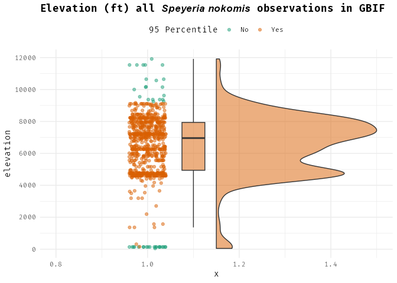
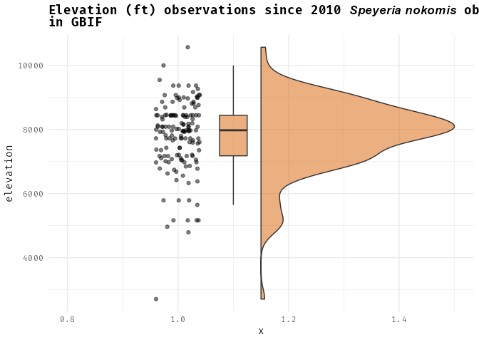
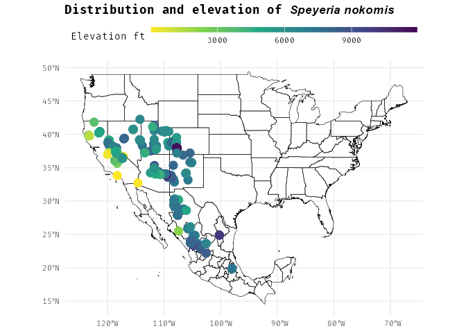

There has been a bit of debate about where silverspot butterflies could
occur on the Columbine Ranger District. Colonies are known to occur up
to 8,300 feet but one individual was seen at 9,300 feet. The FWS wants
us to survey butterflies up to 9,300 feet, but we are skeptical that
they would occur so high given that there are no colonies known from
higher than 8,300 feet.

Here I look at the elevation ranges of *Speyeria nokomis* to inform
elevation ranges of *Speyeria nokomis nokomis* using citizen science
data from GBIF (“GBIF: The Global Biodiversity Information Facility”
2024) data using the rgbif package(Chamberlain, Oldoni, and Waller
2012).

    List of 136
     $ line                            :List of 6
      ..$ colour       : chr "black"
      ..$ linewidth    : num 0.5
      ..$ linetype     : num 1
      ..$ lineend      : chr "butt"
      ..$ arrow        : logi FALSE
      ..$ inherit.blank: logi TRUE
      ..- attr(*, "class")= chr [1:2] "element_line" "element"
     $ rect                            :List of 5
      ..$ fill         : chr "white"
      ..$ colour       : chr "black"
      ..$ linewidth    : num 0.5
      ..$ linetype     : num 1
      ..$ inherit.blank: logi TRUE
      ..- attr(*, "class")= chr [1:2] "element_rect" "element"
     $ text                            :List of 11
      ..$ family       : chr "Fira Code"
      ..$ face         : chr "plain"
      ..$ colour       : chr "black"
      ..$ size         : num 11
      ..$ hjust        : num 0.5
      ..$ vjust        : num 0.5
      ..$ angle        : num 0
      ..$ lineheight   : num 0.9
      ..$ margin       : 'margin' num [1:4] 0points 0points 0points 0points
      .. ..- attr(*, "unit")= int 8
      ..$ debug        : logi FALSE
      ..$ inherit.blank: logi TRUE
      ..- attr(*, "class")= chr [1:2] "element_text" "element"
     $ title                           : NULL
     $ aspect.ratio                    : NULL
     $ axis.title                      : NULL
     $ axis.title.x                    :List of 11
      ..$ family       : NULL
      ..$ face         : NULL
      ..$ colour       : NULL
      ..$ size         : NULL
      ..$ hjust        : NULL
      ..$ vjust        : num 1
      ..$ angle        : NULL
      ..$ lineheight   : NULL
      ..$ margin       : 'margin' num [1:4] 2.75points 0points 0points 0points
      .. ..- attr(*, "unit")= int 8
      ..$ debug        : NULL
      ..$ inherit.blank: logi TRUE
      ..- attr(*, "class")= chr [1:2] "element_text" "element"
     $ axis.title.x.top                :List of 11
      ..$ family       : NULL
      ..$ face         : NULL
      ..$ colour       : NULL
      ..$ size         : NULL
      ..$ hjust        : NULL
      ..$ vjust        : num 0
      ..$ angle        : NULL
      ..$ lineheight   : NULL
      ..$ margin       : 'margin' num [1:4] 0points 0points 2.75points 0points
      .. ..- attr(*, "unit")= int 8
      ..$ debug        : NULL
      ..$ inherit.blank: logi TRUE
      ..- attr(*, "class")= chr [1:2] "element_text" "element"
     $ axis.title.x.bottom             : NULL
     $ axis.title.y                    :List of 11
      ..$ family       : NULL
      ..$ face         : NULL
      ..$ colour       : NULL
      ..$ size         : NULL
      ..$ hjust        : NULL
      ..$ vjust        : num 1
      ..$ angle        : num 90
      ..$ lineheight   : NULL
      ..$ margin       : 'margin' num [1:4] 0points 2.75points 0points 0points
      .. ..- attr(*, "unit")= int 8
      ..$ debug        : NULL
      ..$ inherit.blank: logi TRUE
      ..- attr(*, "class")= chr [1:2] "element_text" "element"
     $ axis.title.y.left               : NULL
     $ axis.title.y.right              :List of 11
      ..$ family       : NULL
      ..$ face         : NULL
      ..$ colour       : NULL
      ..$ size         : NULL
      ..$ hjust        : NULL
      ..$ vjust        : num 1
      ..$ angle        : num -90
      ..$ lineheight   : NULL
      ..$ margin       : 'margin' num [1:4] 0points 0points 0points 2.75points
      .. ..- attr(*, "unit")= int 8
      ..$ debug        : NULL
      ..$ inherit.blank: logi TRUE
      ..- attr(*, "class")= chr [1:2] "element_text" "element"
     $ axis.text                       :List of 11
      ..$ family       : NULL
      ..$ face         : NULL
      ..$ colour       : chr "grey30"
      ..$ size         : 'rel' num 0.8
      ..$ hjust        : NULL
      ..$ vjust        : NULL
      ..$ angle        : NULL
      ..$ lineheight   : NULL
      ..$ margin       : NULL
      ..$ debug        : NULL
      ..$ inherit.blank: logi TRUE
      ..- attr(*, "class")= chr [1:2] "element_text" "element"
     $ axis.text.x                     :List of 11
      ..$ family       : NULL
      ..$ face         : NULL
      ..$ colour       : NULL
      ..$ size         : NULL
      ..$ hjust        : NULL
      ..$ vjust        : num 1
      ..$ angle        : NULL
      ..$ lineheight   : NULL
      ..$ margin       : 'margin' num [1:4] 2.2points 0points 0points 0points
      .. ..- attr(*, "unit")= int 8
      ..$ debug        : NULL
      ..$ inherit.blank: logi TRUE
      ..- attr(*, "class")= chr [1:2] "element_text" "element"
     $ axis.text.x.top                 :List of 11
      ..$ family       : NULL
      ..$ face         : NULL
      ..$ colour       : NULL
      ..$ size         : NULL
      ..$ hjust        : NULL
      ..$ vjust        : num 0
      ..$ angle        : NULL
      ..$ lineheight   : NULL
      ..$ margin       : 'margin' num [1:4] 0points 0points 2.2points 0points
      .. ..- attr(*, "unit")= int 8
      ..$ debug        : NULL
      ..$ inherit.blank: logi TRUE
      ..- attr(*, "class")= chr [1:2] "element_text" "element"
     $ axis.text.x.bottom              : NULL
     $ axis.text.y                     :List of 11
      ..$ family       : NULL
      ..$ face         : NULL
      ..$ colour       : NULL
      ..$ size         : NULL
      ..$ hjust        : num 1
      ..$ vjust        : NULL
      ..$ angle        : NULL
      ..$ lineheight   : NULL
      ..$ margin       : 'margin' num [1:4] 0points 2.2points 0points 0points
      .. ..- attr(*, "unit")= int 8
      ..$ debug        : NULL
      ..$ inherit.blank: logi TRUE
      ..- attr(*, "class")= chr [1:2] "element_text" "element"
     $ axis.text.y.left                : NULL
     $ axis.text.y.right               :List of 11
      ..$ family       : NULL
      ..$ face         : NULL
      ..$ colour       : NULL
      ..$ size         : NULL
      ..$ hjust        : num 0
      ..$ vjust        : NULL
      ..$ angle        : NULL
      ..$ lineheight   : NULL
      ..$ margin       : 'margin' num [1:4] 0points 0points 0points 2.2points
      .. ..- attr(*, "unit")= int 8
      ..$ debug        : NULL
      ..$ inherit.blank: logi TRUE
      ..- attr(*, "class")= chr [1:2] "element_text" "element"
     $ axis.text.theta                 : NULL
     $ axis.text.r                     :List of 11
      ..$ family       : NULL
      ..$ face         : NULL
      ..$ colour       : NULL
      ..$ size         : NULL
      ..$ hjust        : num 0.5
      ..$ vjust        : NULL
      ..$ angle        : NULL
      ..$ lineheight   : NULL
      ..$ margin       : 'margin' num [1:4] 0points 2.2points 0points 2.2points
      .. ..- attr(*, "unit")= int 8
      ..$ debug        : NULL
      ..$ inherit.blank: logi TRUE
      ..- attr(*, "class")= chr [1:2] "element_text" "element"
     $ axis.ticks                      : list()
      ..- attr(*, "class")= chr [1:2] "element_blank" "element"
     $ axis.ticks.x                    : NULL
     $ axis.ticks.x.top                : NULL
     $ axis.ticks.x.bottom             : NULL
     $ axis.ticks.y                    : NULL
     $ axis.ticks.y.left               : NULL
     $ axis.ticks.y.right              : NULL
     $ axis.ticks.theta                : NULL
     $ axis.ticks.r                    : NULL
     $ axis.minor.ticks.x.top          : NULL
     $ axis.minor.ticks.x.bottom       : NULL
     $ axis.minor.ticks.y.left         : NULL
     $ axis.minor.ticks.y.right        : NULL
     $ axis.minor.ticks.theta          : NULL
     $ axis.minor.ticks.r              : NULL
     $ axis.ticks.length               : 'simpleUnit' num 2.75points
      ..- attr(*, "unit")= int 8
     $ axis.ticks.length.x             : NULL
     $ axis.ticks.length.x.top         : NULL
     $ axis.ticks.length.x.bottom      : NULL
     $ axis.ticks.length.y             : NULL
     $ axis.ticks.length.y.left        : NULL
     $ axis.ticks.length.y.right       : NULL
     $ axis.ticks.length.theta         : NULL
     $ axis.ticks.length.r             : NULL
     $ axis.minor.ticks.length         : 'rel' num 0.75
     $ axis.minor.ticks.length.x       : NULL
     $ axis.minor.ticks.length.x.top   : NULL
     $ axis.minor.ticks.length.x.bottom: NULL
     $ axis.minor.ticks.length.y       : NULL
     $ axis.minor.ticks.length.y.left  : NULL
     $ axis.minor.ticks.length.y.right : NULL
     $ axis.minor.ticks.length.theta   : NULL
     $ axis.minor.ticks.length.r       : NULL
     $ axis.line                       : list()
      ..- attr(*, "class")= chr [1:2] "element_blank" "element"
     $ axis.line.x                     : NULL
     $ axis.line.x.top                 : NULL
     $ axis.line.x.bottom              : NULL
     $ axis.line.y                     : NULL
     $ axis.line.y.left                : NULL
     $ axis.line.y.right               : NULL
     $ axis.line.theta                 : NULL
     $ axis.line.r                     : NULL
     $ legend.background               : list()
      ..- attr(*, "class")= chr [1:2] "element_blank" "element"
     $ legend.margin                   : 'margin' num [1:4] 5.5points 5.5points 5.5points 5.5points
      ..- attr(*, "unit")= int 8
     $ legend.spacing                  : 'simpleUnit' num 11points
      ..- attr(*, "unit")= int 8
     $ legend.spacing.x                : NULL
     $ legend.spacing.y                : NULL
     $ legend.key                      : list()
      ..- attr(*, "class")= chr [1:2] "element_blank" "element"
     $ legend.key.size                 : 'simpleUnit' num 1.2lines
      ..- attr(*, "unit")= int 3
     $ legend.key.height               : NULL
     $ legend.key.width                : NULL
     $ legend.key.spacing              : 'simpleUnit' num 5.5points
      ..- attr(*, "unit")= int 8
     $ legend.key.spacing.x            : NULL
     $ legend.key.spacing.y            : NULL
     $ legend.frame                    : NULL
     $ legend.ticks                    : NULL
     $ legend.ticks.length             : 'rel' num 0.2
     $ legend.axis.line                : NULL
     $ legend.text                     :List of 11
      ..$ family       : NULL
      ..$ face         : NULL
      ..$ colour       : NULL
      ..$ size         : 'rel' num 0.8
      ..$ hjust        : NULL
      ..$ vjust        : NULL
      ..$ angle        : NULL
      ..$ lineheight   : NULL
      ..$ margin       : NULL
      ..$ debug        : NULL
      ..$ inherit.blank: logi TRUE
      ..- attr(*, "class")= chr [1:2] "element_text" "element"
     $ legend.text.position            : NULL
     $ legend.title                    :List of 11
      ..$ family       : NULL
      ..$ face         : NULL
      ..$ colour       : NULL
      ..$ size         : NULL
      ..$ hjust        : num 0
      ..$ vjust        : NULL
      ..$ angle        : NULL
      ..$ lineheight   : NULL
      ..$ margin       : NULL
      ..$ debug        : NULL
      ..$ inherit.blank: logi TRUE
      ..- attr(*, "class")= chr [1:2] "element_text" "element"
     $ legend.title.position           : NULL
     $ legend.position                 : chr "right"
     $ legend.position.inside          : NULL
     $ legend.direction                : NULL
     $ legend.byrow                    : NULL
     $ legend.justification            : chr "center"
     $ legend.justification.top        : NULL
     $ legend.justification.bottom     : NULL
     $ legend.justification.left       : NULL
     $ legend.justification.right      : NULL
     $ legend.justification.inside     : NULL
     $ legend.location                 : NULL
     $ legend.box                      : NULL
     $ legend.box.just                 : NULL
     $ legend.box.margin               : 'margin' num [1:4] 0cm 0cm 0cm 0cm
      ..- attr(*, "unit")= int 1
     $ legend.box.background           : list()
      ..- attr(*, "class")= chr [1:2] "element_blank" "element"
     $ legend.box.spacing              : 'simpleUnit' num 11points
      ..- attr(*, "unit")= int 8
      [list output truncated]
     - attr(*, "class")= chr [1:2] "theme" "gg"
     - attr(*, "complete")= logi TRUE
     - attr(*, "validate")= logi TRUE

So it looks like there are observations from 0 to 12,000 feet. However,
the vast majority of the observations are from about 9,200 feet to 4,500
feet. I noticed that a lot of points are old that are from unusual
elevations. Let me filter out very old observations, keeping anything
since the year 2010. These points are more likely to have accurate
location data.

There are fewer occurrences at very high elevations (i.e. \>11,000 feet)
but there is nothing here that demonstrates that they could not be found
up to 9,300 feet.

I want to double check that the high elevation occurrences are not
associated with lower latitudes so let’s map these out.

It does there are high elevation occurances both in Colorado and Mexico
so Latitude doesn’t have that much to do with it.

## Conclusion

After this analysis, I think there is reasonable evidence to suggest
that *Speyeria nokomis nokomis* could occur up to 9,300 feet in
elevation. While I don’t think that it is unlikely that we will find
butterflies above 8,300 feet it appears, from this analysis, that it
could happen.

## References

Chamberlain, Scott, Damiano Oldoni, and John Waller. 2012. “Rgbif:
Interface to the Global Biodiversity Information Facility API.”
<https://doi.org/10.32614/CRAN.package.rgbif>.

“GBIF: The Global Biodiversity Information Facility.” 2024.
<https://www.gbif.org/what-is-gbif>.

